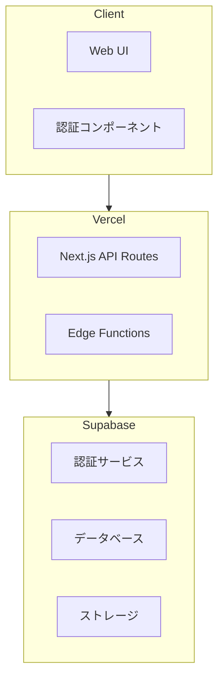
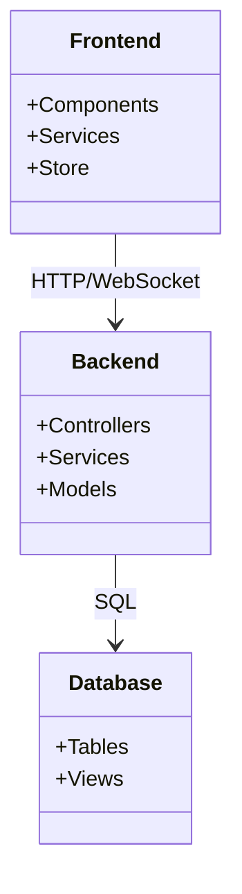
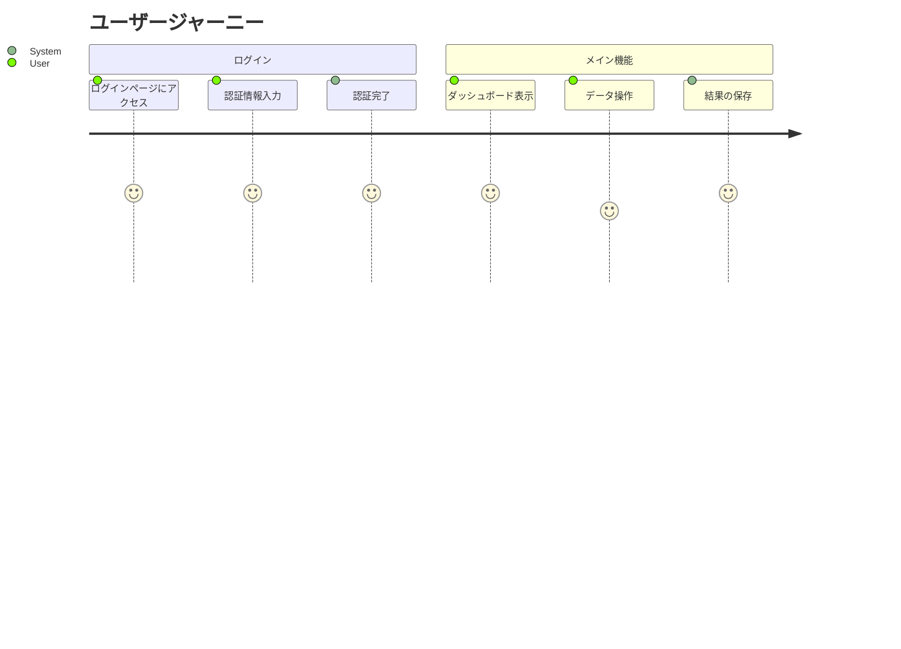

# VouTube システムアーキテクチャ

## システム全体構成

```mermaid
graph TB
    subgraph Client
        UI[Web UI]
        Auth[認証コンポーネント]
    end

    subgraph Vercel
        Next[Next.js API Routes]
        Edge[Edge Functions]
    end

    subgraph Supabase
        Auth_Service[認証サービス]
        DB[データベース]
        Storage[ストレージ]
    end

    Client --> Vercel
    Vercel --> Supabase
```

## コンポーネント関係図

```mermaid
classDiagram
    class Frontend {
        +Components
        +Services
        +Store
    }
    class Backend {
        +Controllers
        +Services
        +Models
    }
    class Database {
        +Tables
        +Views
    }

    Frontend --> Backend: HTTP/WebSocket
    Backend --> Database: SQL
```

## ユーザーフロー

```mermaid
journey
    title ユーザージャーニー
    section ログイン
      ログインページにアクセス: 5: User
      認証情報入力: 5: User
      認証完了: 5: System
    section メイン機能
      ダッシュボード表示: 5: User
      データ操作: 4: User
      結果の保存: 5: System
```
