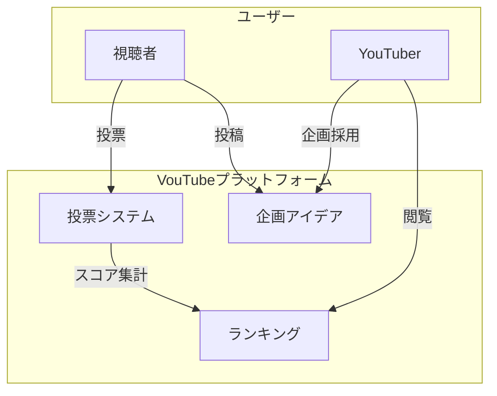
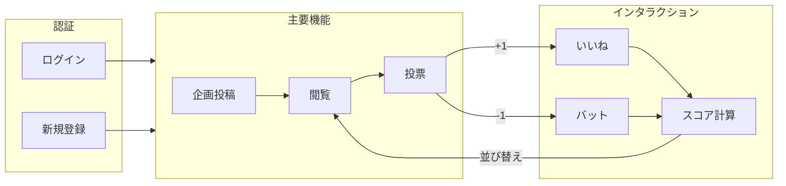
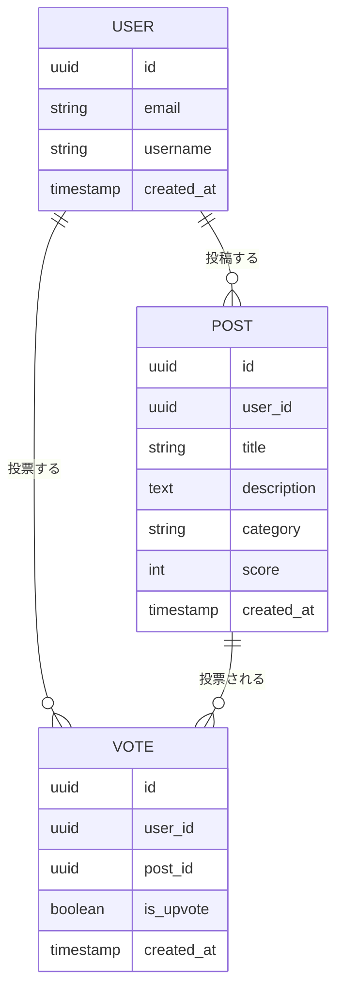
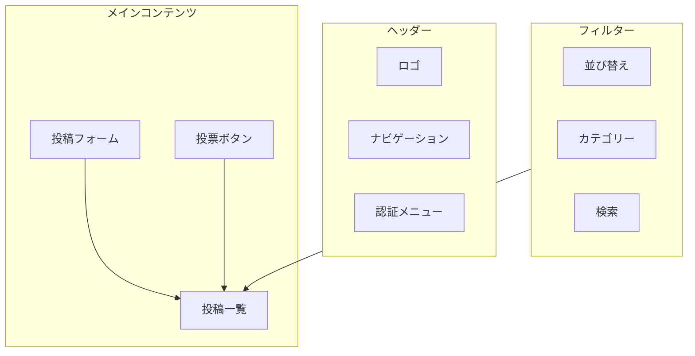

# VouTube アプリケーション概念図

## サービス概要図

```mermaid
graph TB
    subgraph Users[ユーザー]
        Viewer[視聴者]
        YouTuber[YouTuber]
    end

    subgraph Platform[VouTubeプラットフォーム]
        Ideas[企画アイデア]
        Voting[投票システム]
        Ranking[ランキング]
    end

    Viewer -->|投稿| Ideas
    Viewer -->|投票| Voting
    Voting -->|スコア集計| Ranking
    YouTuber -->|閲覧| Ranking
    YouTuber -->|企画採用| Ideas
```

## 機能フロー図

```mermaid
graph LR
    subgraph Authentication[認証]
        Login[ログイン]
        Register[新規登録]
    end

    subgraph MainFeatures[主要機能]
        Post[企画投稿]
        Vote[投票]
        Browse[閲覧]
    end

    subgraph Interaction[インタラクション]
        UpVote[いいね]
        DownVote[バット]
        Score[スコア計算]
    end

    Login --> MainFeatures
    Register --> MainFeatures
    Post --> Browse
    Browse --> Vote
    Vote --> |+1| UpVote
    Vote --> |-1| DownVote
    UpVote --> Score
    DownVote --> Score
    Score --> |並び替え| Browse
```

## データモデル概念図

```mermaid
erDiagram
    USER ||--o{ POST : "投稿する"
    USER ||--o{ VOTE : "投票する"
    POST ||--o{ VOTE : "投票される"

    USER {
        uuid id
        string email
        string username
        timestamp created_at
    }

    POST {
        uuid id
        uuid user_id
        string title
        text description
        string category
        int score
        timestamp created_at
    }

    VOTE {
        uuid id
        uuid user_id
        uuid post_id
        boolean is_upvote
        timestamp created_at
    }
```

## ユーザーインターフェース概念図

```mermaid
graph TB
    subgraph Header[ヘッダー]
        Logo[ロゴ]
        Nav[ナビゲーション]
        Auth[認証メニュー]
    end

    subgraph Main[メインコンテンツ]
        PostList[投稿一覧]
        PostForm[投稿フォーム]
        VoteButtons[投票ボタン]
    end

    subgraph Filters[フィルター]
        Sort[並び替え]
        Category[カテゴリー]
        Search[検索]
    end

    Filters --> PostList
    PostForm --> PostList
    VoteButtons --> PostList
``` 