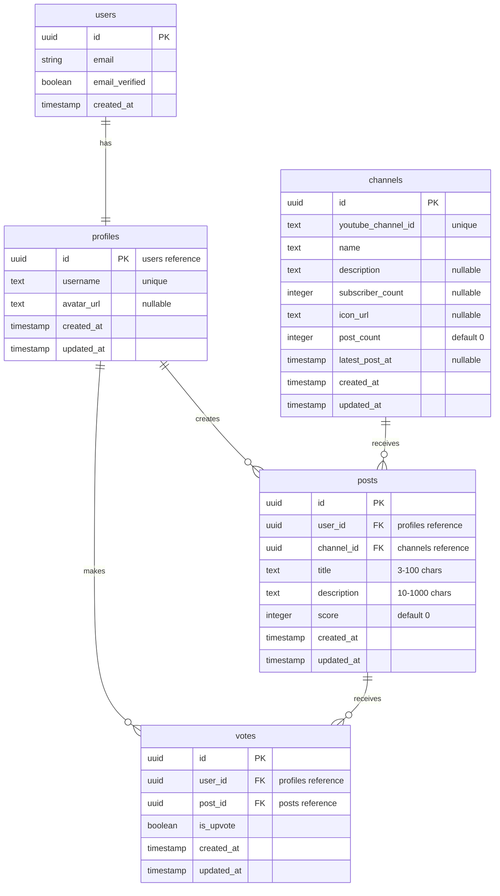

# VouTube データベースER図

## リレーションシップの説明

1. **users - profiles**
   - 1:1の関係
   - ユーザー認証情報とプロフィール情報の紐付け
   - カスケード削除

2. **profiles - posts**
   - 1:多の関係
   - 1つのプロフィールが複数の投稿を作成可能
   - カスケード削除

3. **channels - posts**
   - 1:多の関係
   - 1つのチャンネルが複数の投稿を受け取る
   - カスケード削除

4. **profiles - votes**
   - 1:多の関係
   - 1つのプロフィールが複数の投票を行うことが可能
   - カスケード削除

5. **posts - votes**
   - 1:多の関係
   - 1つの投稿が複数の投票を受けることが可能
   - カスケード削除

## 制約

1. **profiles**
   - username: 一意制約
   - username: 3文字以上の長さ制約

2. **channels**
   - youtube_channel_id: 一意制約
   - post_count: 0以上の整数
   - 統計情報は自動更新

3. **posts**
   - title: 3-100文字の長さ制約
   - description: 10-1000文字の長さ制約
   - score: デフォルト値0

4. **votes**
   - user_id + post_id: 一意制約（1ユーザー1投稿につき1票）

## インデックス

1. **channels**
   - post_count: 降順インデックス
   - latest_post_at: 降順インデックス
   - youtube_channel_id: 検索用インデックス

2. **posts**
   - channel_id + score: チャンネル別スコア順表示用
   - channel_id + created_at: チャンネル別新着順表示用

3. **votes**
   - post_id: 集計用インデックス

## トリガー

1. **posts**
   - 投稿作成時: チャンネルの投稿数と最新投稿日時を更新
   - 投稿削除時: チャンネルの投稿数を減算し、最新投稿日時を再計算

2. **votes**
   - 投票時: 投稿のスコアを再計算
   - 投票削除時: 投稿のスコアを再計算 