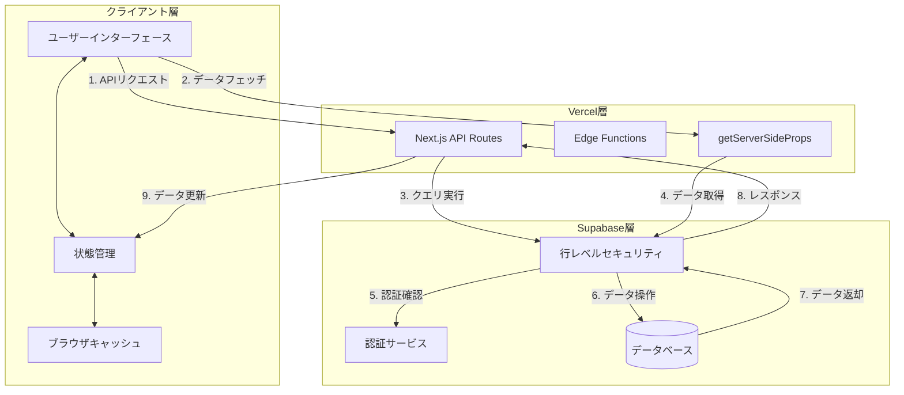
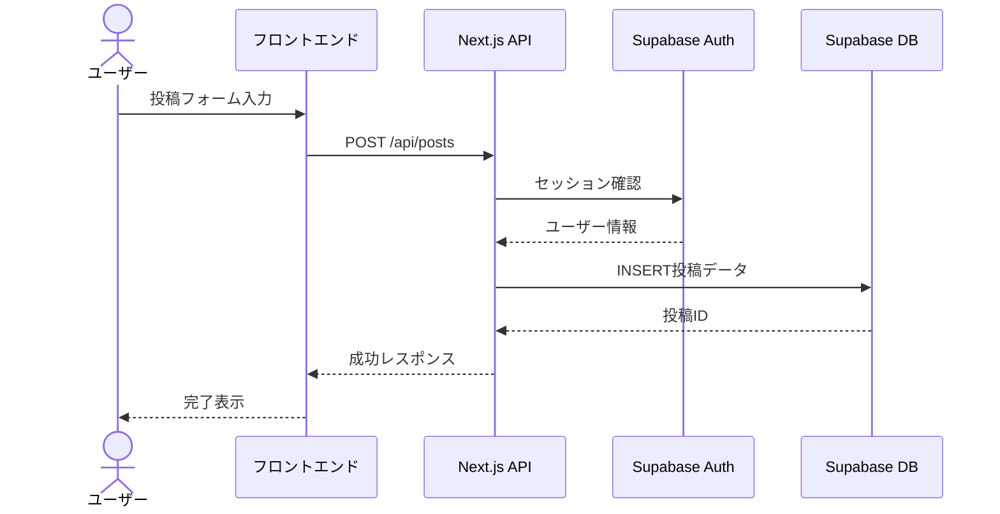
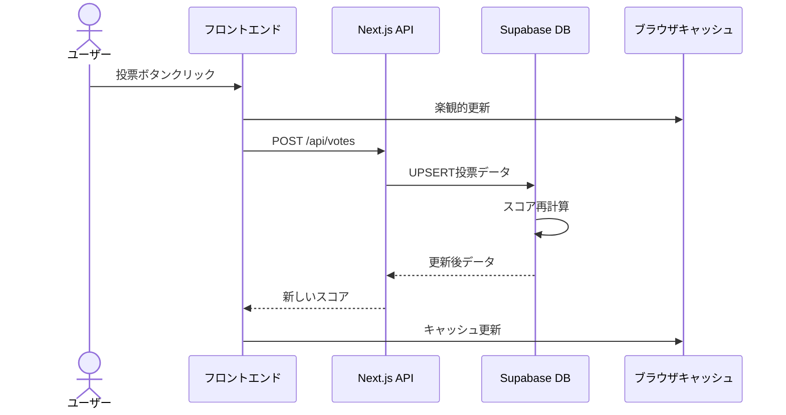
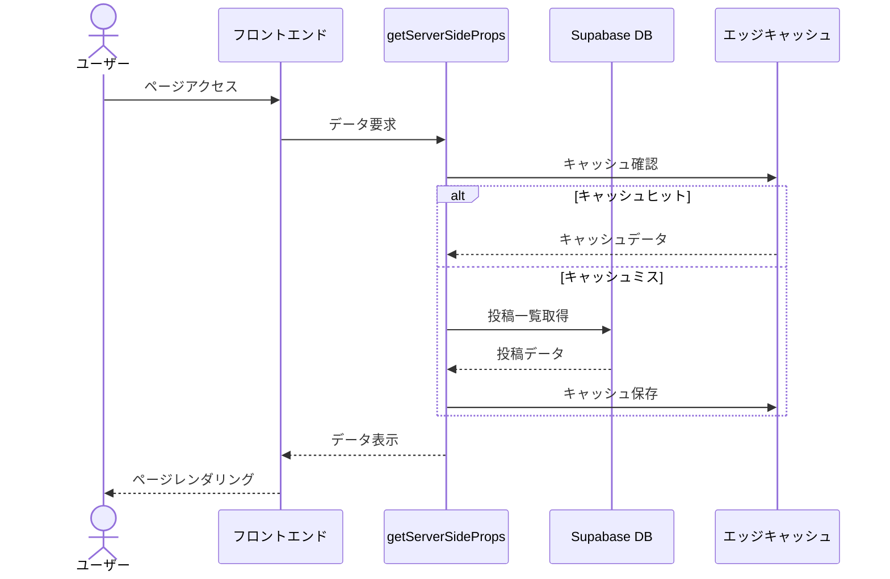

# IdeaTube データフロー図

## 全体のデータフロー

## 主要機能のデータフロー

### 1. 投稿フロー

### 2. 投票フロー

### 3. 一覧表示フロー

## データの更新パターン

1. **即時更新**
   - 投票操作
   - コメント投稿
   - 投稿の削除

2. **定期更新**
   - スコアの集計
   - ランキングの更新
   - キャッシュの破棄

3. **バッチ処理**
   - デッドロック解消
   - データクリーンアップ
   - 統計情報の更新 