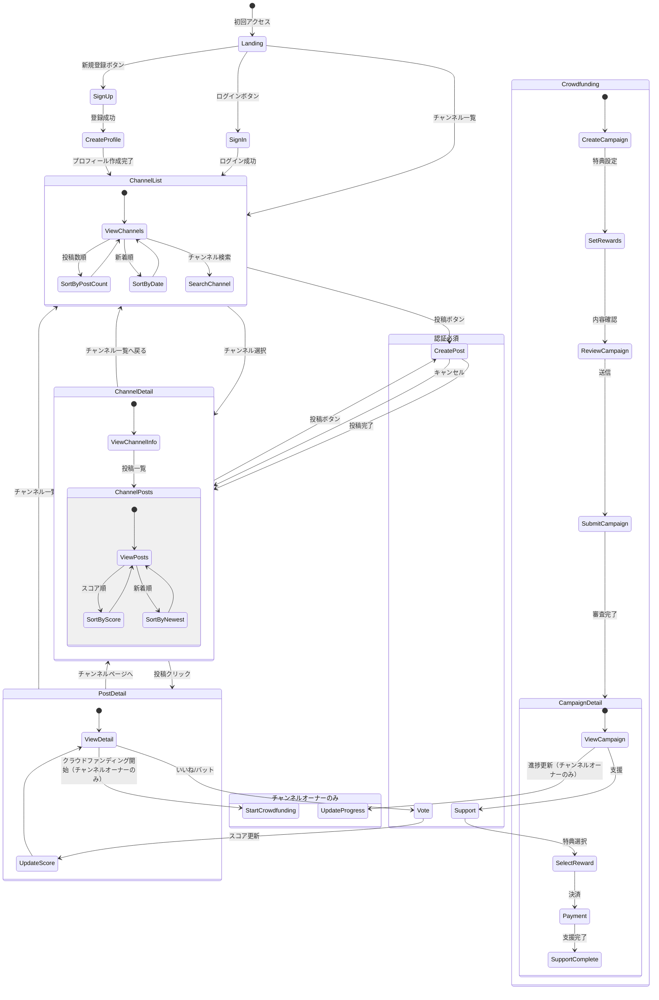

# IdeaTube 画面遷移図

## 画面説明

### 1. ランディングページ（Landing）
- サービス説明
- ログイン/新規登録ボタン
- チャンネル一覧へのリンク

### 2. 認証画面
- **サインイン（SignIn）**
  - Googleログイン
- **サインアップ（SignUp）**
  - Googleアカウント連携

### 3. プロフィール作成（CreateProfile）
- ユーザーネーム設定
- アバター画像アップロード（オプション）

### 4. チャンネル一覧（ChannelList）
- 投稿数順/新着順の切り替え
- チャンネル検索機能
- チャンネルカード表示
  - チャンネル名
  - アイコン
  - 投稿数
  - 最新の投稿日

### 5. チャンネル詳細（ChannelDetail）
- チャンネル情報
  - チャンネル名
  - 説明
  - 登録者数
  - 総投稿数
- 投稿一覧
  - スコア順/新着順の切り替え
  - 無限スクロール
  - 投稿ボタン（認証済みユーザーのみ）

### 6. 投稿作成（CreatePost）
- タイトル入力
- 説明文入力
- カテゴリー選択
- 投稿/キャンセルボタン
- 対象チャンネルは自動設定

### 7. 投稿詳細（PostDetail）
- 投稿の詳細表示
- いいね/バットボタン（認証済みユーザーのみ）
- 現在のスコア表示
- 投稿者情報
- チャンネル情報
- クラウドファンディング開始ボタン（チャンネルオーナーのみ）

### 8. クラウドファンディング作成（Crowdfunding）
- キャンペーン情報入力
  - タイトル
  - 説明
  - 目標金額（All in型）
  - 支援期間
- 特典設定
  - 特典内容
  - 支援金額
  - 数量
- 内容確認
- 審査申請

### 9. キャンペーン詳細（CampaignDetail）
- キャンペーン情報表示
  - 現在の支援金額
  - 目標金額
  - 残り期間
  - 支援者数
- 特典一覧
- 支援ボタン
- 進捗更新（チャンネルオーナーのみ）

## 遷移ルール

1. **認証関連**
   - 未認証ユーザーは閲覧のみ可能
   - 投稿・投票・支援には認証が必要
   - 認証後は直前の画面に戻る

2. **チャンネル関連**
   - チャンネル一覧から各チャンネルページへ遷移
   - チャンネルページでは該当チャンネル向けの投稿のみ表示
   - チャンネル情報はAPIから自動取得

3. **投稿関連**
   - 投稿作成は認証済みユーザーのみ
   - チャンネルページからの投稿は対象チャンネルが自動設定
   - 投稿後は該当チャンネルページに戻る

4. **投票関連**
   - 各投稿に対して1ユーザー1票
   - 投票は切り替え可能（いいね⇔バット）
   - 投票の取り消しも可能

5. **クラウドファンディング関連**
   - クラウドファンディング開始はチャンネルオーナーのみ
   - All in型のため、目標金額達成に関わらず支援金を受け取る
   - 支援は認証済みユーザーのみ可能
   - 特典は数量限定で先着順
   - 進捗更新はチャンネルオーナーのみ可能

6. **レスポンシブ対応**
   - モバイル/デスクトップで同じ遷移フロー
   - レイアウトのみ変更 