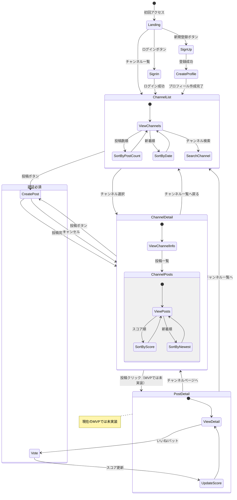

# VouTube 画面遷移図

## 画面説明

### 1. ランディングページ（Landing）
- サービス説明
- ログイン/新規登録ボタン
- チャンネル一覧へのリンク

### 2. 認証画面
- **サインイン（SignIn）**
  - メールアドレス/パスワード
  - Googleログイン
- **サインアップ（SignUp）**
  - メールアドレス/パスワード
  - Googleアカウント連携

### 3. プロフィール作成（CreateProfile）
- ユーザーネーム設定
- アバター画像アップロード（オプション）

### 4. チャンネル一覧（ChannelList）
- 投稿数順/新着順の切り替え
- チャンネル検索機能
- チャンネルカード表示
  - チャンネル名
  - アイコン
  - 投稿数
  - 最新の投稿日

### 5. チャンネル詳細（ChannelDetail）
- チャンネル情報
  - チャンネル名
  - 説明
  - 登録者数
  - 総投稿数
- 投稿一覧
  - スコア順/新着順の切り替え
  - 無限スクロール
  - 投稿ボタン（認証済みユーザーのみ）

### 6. 投稿作成（CreatePost）
- タイトル入力
- 説明文入力
- カテゴリー選択
- 投稿/キャンセルボタン
- 対象チャンネルは自動設定

### 7. 投稿詳細（PostDetail）※MVPでは未実装
- 投稿の詳細表示
- いいね/バットボタン（認証済みユーザーのみ）
- 現在のスコア表示
- 投稿者情報
- チャンネル情報
- 注：現在のバージョンでは詳細ページは未実装で、カード表示のみ対応しています

## 遷移ルール

1. **認証関連**
   - 未認証ユーザーは閲覧のみ可能
   - 投稿・投票には認証が必要
   - 認証後は直前の画面に戻る

2. **チャンネル関連**
   - チャンネル一覧から各チャンネルページへ遷移
   - チャンネルページでは該当チャンネル向けの投稿のみ表示
   - チャンネル情報はAPIから自動取得

3. **投稿関連**
   - 投稿作成は認証済みユーザーのみ
   - チャンネルページからの投稿は対象チャンネルが自動設定
   - 投稿後は該当チャンネルページに戻る
   - 投稿の編集・削除は未実装（MVP対象外）
   - 投稿詳細ページは未実装（MVPでは投稿カードのみで表示）

4. **投票関連**
   - 各投稿に対して1ユーザー1票
   - 投票は切り替え可能（いいね⇔バット）
   - 投票の取り消しも可能

5. **レスポンシブ対応**
   - モバイル/デスクトップで同じ遷移フロー
   - レイアウトのみ変更 