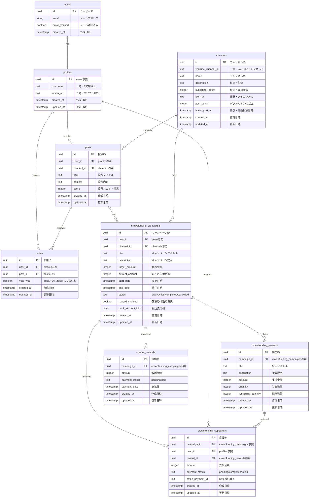

# IdeaTube データベースER図

## リレーションシップの説明

1. **users - profiles**
   - 1:1の関係
   - ユーザー認証情報とプロフィール情報の紐付け
   - カスケード削除

2. **profiles - posts**
   - 1:多の関係
   - 1つのプロフィールが複数の投稿を作成可能
   - カスケード削除

3. **channels - posts**
   - 1:多の関係
   - 1つのチャンネルが複数の投稿を受け取る
   - カスケード削除

4. **profiles - votes**
   - 1:多の関係
   - 1つのプロフィールが複数の投票を行うことが可能
   - カスケード削除

5. **posts - votes**
   - 1:多の関係
   - 1つの投稿が複数の投票を受けることが可能
   - カスケード削除

6. **posts - crowdfunding_campaigns**
   - 1:多の関係
   - 1つの投稿が複数のクラウドファンディングキャンペーンを持つことが可能
   - カスケード削除

7. **channels - crowdfunding_campaigns**
   - 1:多の関係
   - 1つのチャンネルが複数のクラウドファンディングキャンペーンを持つことが可能
   - カスケード削除

8. **crowdfunding_campaigns - crowdfunding_rewards**
   - 1:多の関係
   - 1つのキャンペーンが複数の特典を提供可能
   - カスケード削除

9. **crowdfunding_campaigns - crowdfunding_supporters**
   - 1:多の関係
   - 1つのキャンペーンが複数の支援者を持つことが可能
   - カスケード削除

10. **profiles - crowdfunding_supporters**
    - 1:多の関係
    - 1つのプロフィールが複数の支援を行うことが可能
    - カスケード削除

11. **crowdfunding_rewards - crowdfunding_supporters**
    - 1:多の関係
    - 1つの特典が複数の支援者によって選択されることが可能
    - カスケード削除

12. **crowdfunding_supporters - crowdfunding_payments**
    - 1:多の関係
    - 1つの支援が複数の支払いを持つことが可能
    - カスケード削除

## 制約

1. **profiles**
   - username: 一意制約
   - username: 3文字以上の長さ制約

2. **channels**
   - youtube_channel_id: 一意制約
   - post_count: 0以上の整数
   - 統計情報は自動更新

3. **posts**
   - title: 3-100文字の長さ制約
   - description: 10-1000文字の長さ制約
   - score: デフォルト値0

4. **votes**
   - user_id + post_id: 一意制約（1ユーザー1投稿につき1票）

5. **crowdfunding_campaigns**
   - title: 3-100文字の長さ制約
   - description: 10-1000文字の長さ制約
   - target_amount: 0より大きい整数
   - current_amount: 0以上の整数
   - end_date: start_dateより後の日時
   - status: draft/active/completed/cancelledのいずれか

6. **crowdfunding_rewards**
   - title: 3-100文字の長さ制約
   - description: 10-1000文字の長さ制約
   - amount: 0より大きい整数
   - quantity: 0より大きい整数
   - remaining_quantity: 0以上の整数かつquantity以下

7. **crowdfunding_supporters**
   - amount: 0より大きい整数
   - amount: 選択した特典の金額以上
   - status: pending/completed/failed/refundedのいずれか

8. **crowdfunding_payments**
   - amount: 0より大きい整数
   - status: pending/succeeded/failed/refundedのいずれか

## インデックス

1. **channels**
   - post_count: 降順インデックス
   - latest_post_at: 降順インデックス
   - youtube_channel_id: 検索用インデックス

2. **posts**
   - channel_id + score: チャンネル別スコア順表示用
   - channel_id + created_at: チャンネル別新着順表示用

3. **votes**
   - post_id: 集計用インデックス

4. **crowdfunding_campaigns**
   - channel_id: チャンネル別検索用
   - status: ステータス別検索用
   - start_date + end_date: 日付範囲検索用

5. **crowdfunding_rewards**
   - campaign_id: キャンペーン別検索用

6. **crowdfunding_supporters**
   - campaign_id: キャンペーン別検索用
   - user_id: ユーザー別検索用

7. **crowdfunding_payments**
   - supporter_id: 支援者別検索用
   - stripe_payment_intent_id: Stripe決済検索用

## トリガー

1. **posts**
   - 投稿作成時: チャンネルの投稿数と最新投稿日時を更新
   - 投稿削除時: チャンネルの投稿数を減算し、最新投稿日時を再計算

2. **votes**
   - 投票時: 投稿のスコアを再計算
   - 投票削除時: 投稿のスコアを再計算

3. **crowdfunding_supporters**
   - 支援作成時: キャンペーンの現在の支援金額を更新
   - 支援更新時: キャンペーンの現在の支援金額を更新
   - 支援作成時: 特典の残り数量を更新
   - 支援更新時: 特典の残り数量を更新 