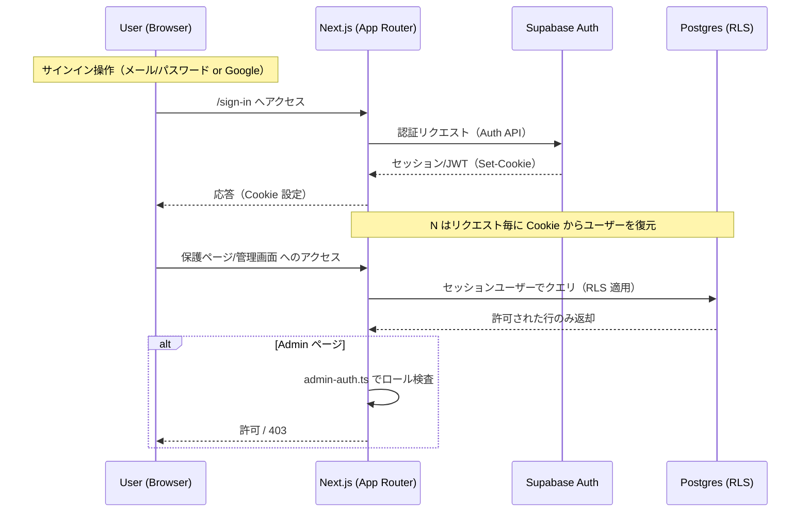

# Voutube 学習ノート Day 1 — 認証/権限（Supabase Auth + Admin）全体像

本ノートは、まず「どういう仕組みでシステムが動いているか」を認証/権限領域に絞って全体像として把握することを目的とします（今日は概説、次回はコードリーディング）。主要トピックは Supabase Auth（メール/パスワード・Google OAuth）、セッション伝播、RLS（Row Level Security）と Admin 権限の確認、Next.js 側の保護（Middleware / API / Server Actions）です。

---

## エグゼクティブサマリー
- 本システムは Next.js（App Router）をフロント/サーバ同居の BFF として用い、認証は Supabase Auth が担当します。 [S1][S2]  
- クライアント/サーバの両方から Supabase クライアントを使い分け、Cookie ベースのセッションを Next.js へ伝播します。 [S3][S4]  
- 権限は「RLS（DB 側）＋アプリ側のガード（Middleware / ライブラリ関数）」の二層構え。管理画面は Admin ロールのチェックで保護されます。 [S5][S6][S7]  
- 外部連携（Stripe Webhook 等）で RLS を越える必要がある箇所は Service Role Key を使いサーバ側のみで実行します（クライアントには絶対に出さない）。 [S8][S9]

---

## ビッグピクチャー（概念図）


---

## 主なフロー（高レベル）

### 1) メール/パスワードのサインイン
- UI: `app/(auth-pages)/sign-in/page.tsx` からフォーム送信。 [S10]  
- サーバ処理: `app/actions/auth.ts`（Server Actions）で Supabase Auth を呼び出し、成功時はセッション Cookie が設定されます。 [S11][S3]  
- 以降の API / Server Component は Cookie からユーザーを復元し、RLS によりユーザー自身のデータのみ参照/更新できます。 [S3][S4]

### 2) Google OAuth のサインイン
- UI: `components/google-signin-button.tsx` から OAuth 開始。 [S12]  
- コールバック: `app/auth/callback/route.ts` で Supabase 側の認可後にセッション設定/画面遷移。 [S13]

### 3) 権限制御（Admin）
- DB 側で Admin ロール管理（マスタ/リレーション）を保持するマイグレーションがあり、アプリ側は `app/lib/admin-auth.ts` でユーザーが Admin か判定します。 [S5][S6]  
- 管理画面（`app/admin/page.tsx`）や Admin API（`app/api/admin/**`）でこのガードを適用。 [S14][S15]

### 4) セッションの伝播と使い分け
- クライアント用 Supabase: `utils/supabase/client.ts`（匿名キー / 公開 URL） [S3]  
- サーバ用 Supabase: `utils/supabase/server.ts`（リクエスト Cookie 経由でユーザー復元） [S4]  
- Next.js Middleware: `middleware.ts` で特定パスのガード/リダイレクトなど（必要に応じて）。 [S7]

### 5) RLS と Service Role の使い分け
- 通常の CRUD は RLS でユーザー毎に制限。  
- Webhook などシステム主体での更新は `SUPABASE_SERVICE_ROLE_KEY` を使い RLS をバイパス（例：Stripe Webhook）。 [S8][S9]

---

## 設定と環境変数（抜粋）
- `.env.example` に主要キーが列挙（`NEXT_PUBLIC_SUPABASE_URL`, `NEXT_PUBLIC_SUPABASE_ANON_KEY`, `SUPABASE_SERVICE_ROLE_KEY` など）。 [S2]  
- Service Role Key は「サーバのみ」で使用。クライアントへ露出しないようにするのが絶対条件。 [S8]

---

## コードパス索引（認証/権限）

| 区分 | ファイル / パス | 役割 |
| --- | --- | --- |
| UI/ページ | `app/(auth-pages)/sign-in/page.tsx` 他 | サインイン/パスワード UI [S10] |
|  | `app/auth/callback/route.ts` | OAuth コールバック [S13] |
|  | `app/admin/page.tsx`, `app/admin/components/admin-dashboard.tsx` | 管理画面 [S14] |
| ロジック | `app/actions/auth.ts` | 認証 Server Action [S11] |
|  | `app/lib/admin-auth.ts` | Admin 判定ユーティリティ [S5] |
| Supabase クライアント | `utils/supabase/client.ts` | ブラウザ用 Supabase [S3] |
|  | `utils/supabase/server.ts` | サーバ用 Supabase [S4] |
| Middleware | `middleware.ts` | ルート保護/リダイレクト [S7] |
| API ルート | `app/api/admin/**` | 管理系 API [S15] |
| データ | `database.types.ts` | 型定義 [S16] |
|  | `supabase/migrations/20250806223955_add_admin_roles.sql` | Admin ロール DDL [S6] |

---

## ローカル実行チェックリスト（認証に最低限必要）

1. リポジトリを取得して依存を導入  
   ```bash
   npm install
   ```
2. 環境変数を準備  
   - `.env.example` を参考に `.env.local` を作成し、少なくとも以下を設定 [S2]  
     - `NEXT_PUBLIC_SUPABASE_URL`  
     - `NEXT_PUBLIC_SUPABASE_ANON_KEY`  
     - （必要に応じて）`SUPABASE_SERVICE_ROLE_KEY`（サーバ側のみ使用）  
   - Google OAuth を試す場合は Google Console でクライアント ID / Secret を発行して設定
3. DB と Auth の初期化  
   - 既存の Supabase プロジェクトを使う、またはローカル Supabase を用意  
   - 初期スキーマ / シード: `scripts/db/init.sql`, `scripts/db/seed.sql` を参考に投入 [S17]
4. 開発サーバを起動  
   ```bash
   npm run dev
   ```
5. 動作確認  
   - `/sign-in` でメール/パスワード認証  
   - 管理画面 `/admin` へアクセスし、Admin でないユーザーは拒否されることを確認

---

## 今日のゴールと次回（コードリーディング）
- **今日**：認証/権限の全体像（データ/アプリ二層のガード、クライアント/サーバの使い分け）を把握。  
- **次回**：以下の順で実コードを段階的に読み解きます。  
  1. `app/actions/auth.ts` — Supabase Auth 呼び出し [S11]  
  2. `utils/supabase/server.ts` — Cookie → ユーザー復元 [S4]  
  3. `app/lib/admin-auth.ts` と `/admin` / `/api/admin/**` での適用箇所 [S5][S14][S15]  
  4. `middleware.ts` — ルート保護ロジック [S7]  
  5. マイグレーション `add_admin_roles.sql` と `database.types.ts` での型の流れ [S6][S16]

---

## Sources
[S1] README.md（プロジェクト概要）  
[S2] .env.example（必要な環境変数）  
[S3] utils/supabase/client.ts（クライアント用 Supabase）  
[S4] utils/supabase/server.ts（サーバ用 Supabase／Cookie からの復元）  
[S5] app/lib/admin-auth.ts（Admin 判定ユーティリティ）  
[S6] supabase/migrations/20250806223955_add_admin_roles.sql（Admin ロール関連）  
[S7] middleware.ts（ルート保護/リダイレクト等）  
[S8] app/api/crowdfunding/webhook/route.ts（Service Role 利用の代表例）  
[S9] app/lib/stripe.ts（サーバ側秘密鍵の扱い）  
[S10] app/(auth-pages)/**（サインイン/パスワード周辺 UI）  
[S11] app/actions/auth.ts（認証 Server Action）  
[S12] components/google-signin-button.tsx（OAuth トリガ）  
[S13] app/auth/callback/route.ts（OAuth コールバック）  
[S14] app/admin/page.tsx, app/admin/components/admin-dashboard.tsx（管理画面）  
[S15] app/api/admin/**（管理系 API）  
[S16] database.types.ts（型定義）  
[S17] scripts/db/init.sql, scripts/db/seed.sql（初期化/シード）
